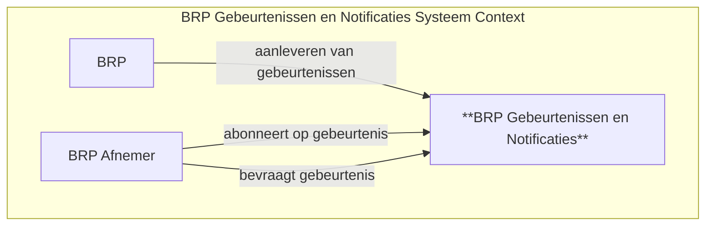

# BRP Gebeurtenissen en Notificaties

De BRP Gebeurtenissen en Notificaties vangt mutaties aan personen in de Basis Registratie af, vertaalt deze mutaties naar gebeurtenissen en legt ze vervolgens in tijd vast.

Geautoriseerde afnemers kunnen deze gebeurtenissen bevragen om hun processen en dienstverlening hierop te baseren. Een afnemer kan zich abonneren op specifieke gebeurtenissen of op specifieke gebeurtenissen van personen die zij moeten volgen voor hun dienstverlening. De afnemer wordt vervolgens in staat gesteld om op te vragen of de specifieke gebeurtenis van de gevolgde persoon heeft plaatsgevonden. Het grote voordeel hiervan is dat afnemers niet periodiek de BRP hoeft te bevragen om zelf te achterhalen of specifieke gebeurtenissen bij specifieke personen heeft plaatsgevonden.

