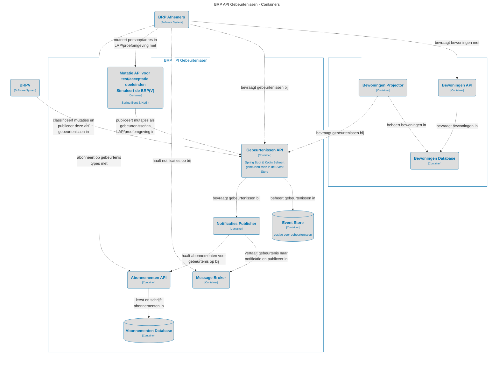

```mermaid
graph LR
  linkStyle default fill:#ffffff

  subgraph diagram ["BRP API Gebeurtenissen - Containers"]
    style diagram fill:#ffffff,stroke:#ffffff

    1("<div style='font-weight: bold'>BRPV</div><div style='font-size: 70%; margin-top: 0px'>[Software System]</div>")
    style 1 fill:#dddddd,stroke:#0773af,color:#0773af
    10("<div style='font-weight: bold'>BRP Afnemers</div><div style='font-size: 70%; margin-top: 0px'>[Software System]</div>")
    style 10 fill:#dddddd,stroke:#0773af,color:#0773af

    subgraph 11 ["BRP API Bewoningen"]
      style 11 fill:#ffffff,stroke:#0773af,color:#0773af

      12("<div style='font-weight: bold'>Bewoningen Projector</div><div style='font-size: 70%; margin-top: 0px'>[Container]</div>")
      style 12 fill:#dddddd,stroke:#0773af,color:#0773af
      13("<div style='font-weight: bold'>Bewoningen Database</div><div style='font-size: 70%; margin-top: 0px'>[Container]</div>")
      style 13 fill:#dddddd,stroke:#0773af,color:#0773af
      14("<div style='font-weight: bold'>Bewoningen API</div><div style='font-size: 70%; margin-top: 0px'>[Container]</div>")
      style 14 fill:#dddddd,stroke:#0773af,color:#0773af
    end

    subgraph 2 ["BRP API Gebeurtenissen"]
      style 2 fill:#ffffff,stroke:#0773af,color:#0773af

      3[("<div style='font-weight: bold'>Event Store</div><div style='font-size: 70%; margin-top: 0px'>[Container]</div><div style='font-size: 80%; margin-top:10px'>opslag voor gebeurtenissen</div>")]
      style 3 fill:#dddddd,stroke:#0773af,color:#0773af
      4("<div style='font-weight: bold'>Notificaties Publisher</div><div style='font-size: 70%; margin-top: 0px'>[Container]</div>")
      style 4 fill:#dddddd,stroke:#0773af,color:#0773af
      5("<div style='font-weight: bold'>Message Broker</div><div style='font-size: 70%; margin-top: 0px'>[Container]</div>")
      style 5 fill:#dddddd,stroke:#0773af,color:#0773af
      6("<div style='font-weight: bold'>Mutatie API voor test/acceptatie doeleinden\nSimuleert de BRP(V)</div><div style='font-size: 70%; margin-top: 0px'>[Container]</div><div style='font-size: 80%; margin-top:10px'>Spring Boot & Kotlin</div>")
      style 6 fill:#dddddd,stroke:#0773af,color:#0773af
      7("<div style='font-weight: bold'>Gebeurtenissen API</div><div style='font-size: 70%; margin-top: 0px'>[Container]</div><div style='font-size: 80%; margin-top:10px'>Spring Boot & Kotlin Beheert<br />gebeurtenissen in de Event<br />Store</div>")
      style 7 fill:#dddddd,stroke:#0773af,color:#0773af
      8("<div style='font-weight: bold'>Abonnementen API</div><div style='font-size: 70%; margin-top: 0px'>[Container]</div>")
      style 8 fill:#dddddd,stroke:#0773af,color:#0773af
      9[("<div style='font-weight: bold'>Abonnementen Database</div><div style='font-size: 70%; margin-top: 0px'>[Container]</div>")]
      style 9 fill:#dddddd,stroke:#0773af,color:#0773af
    end

    10-. "<div>abonneert op gebeurtenis<br />types met</div><div style='font-size: 70%'></div>" .->8
    8-. "<div>leest en schrijft<br />abonnementen in</div><div style='font-size: 70%'></div>" .->9
    10-. "<div>muteert persoon/adres in<br />LAP/proefomgeving met</div><div style='font-size: 70%'></div>" .->6
    6-. "<div>publiceert mutaties als<br />gebeurtenissen in<br />LAP/proefomgeving in</div><div style='font-size: 70%'></div>" .->7
    1-. "<div>classificeert mutaties en<br />publiceer deze als<br />gebeurtenissen in</div><div style='font-size: 70%'></div>" .->7
    7-. "<div>bevraagt gebeurtenissen bij</div><div style='font-size: 70%'></div>" .->4
    4-. "<div>haalt abonnementen voor<br />gebeurtenis op bij</div><div style='font-size: 70%'></div>" .->8
    4-. "<div>vertaalt gebeurtenis naar<br />notificatie en publiceer in</div><div style='font-size: 70%'></div>" .->5
    10-. "<div>haalt notificaties op bij</div><div style='font-size: 70%'></div>" .->5
    10-. "<div>bevraagt gebeurtenissen bij</div><div style='font-size: 70%'></div>" .->7
    7-. "<div>beheert gebeurtenissen in</div><div style='font-size: 70%'></div>" .->3
    12-. "<div>bevraagt gebeurtenissen bij</div><div style='font-size: 70%'></div>" .->7
    12-. "<div>beheert bewoningen in</div><div style='font-size: 70%'></div>" .->13
    14-. "<div>bevraagt bewoningen in</div><div style='font-size: 70%'></div>" .->13
    10-. "<div>bevraagt bewoningen met</div><div style='font-size: 70%'></div>" .->14
  end
```