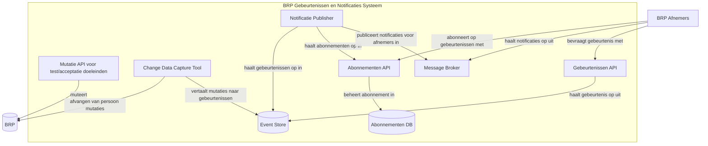

```mermaid
    flowchart TD

    MutApi -- muteert --> BRP[(BRP)]
    CDC  -- afvangen van persoon mutaties --> BRP

    subgraph "BRP Gebeurtenissen en Notificaties Systeem"
        direction LR

        MutApi[Mutatie API voor test/acceptatie doeleinden]
        CDC[Change Data Capture Tool]
        ES[(Event Store)]
        NP[Notificatie Publisher]
        MB[Message Broker]
        GebApi[Gebeurtenissen API]
        SubApi[Abonnementen API]
        SubApi -- beheert abonnement in --> SubDb[(Abonnementen DB)]

        CDC -- vertaalt mutaties naar gebeurtenissen --> ES
        NP -- haalt gebeurtenissen op in --> ES
        NP -- haalt abonnementen op in --> SubApi
        NP -- publiceert notificaties voor afnemers in --> MB

        GebApi -- haalt gebeurtenis op uit --> ES
    end

    BRPAfn -- abonneert op gebeurtenissen met --> SubApi
    BRPAfn[BRP Afnemers] -- haalt notificaties op uit --> MB
    BRPAfn -- bevraagt gebeurtenis met --> GebApi
```
