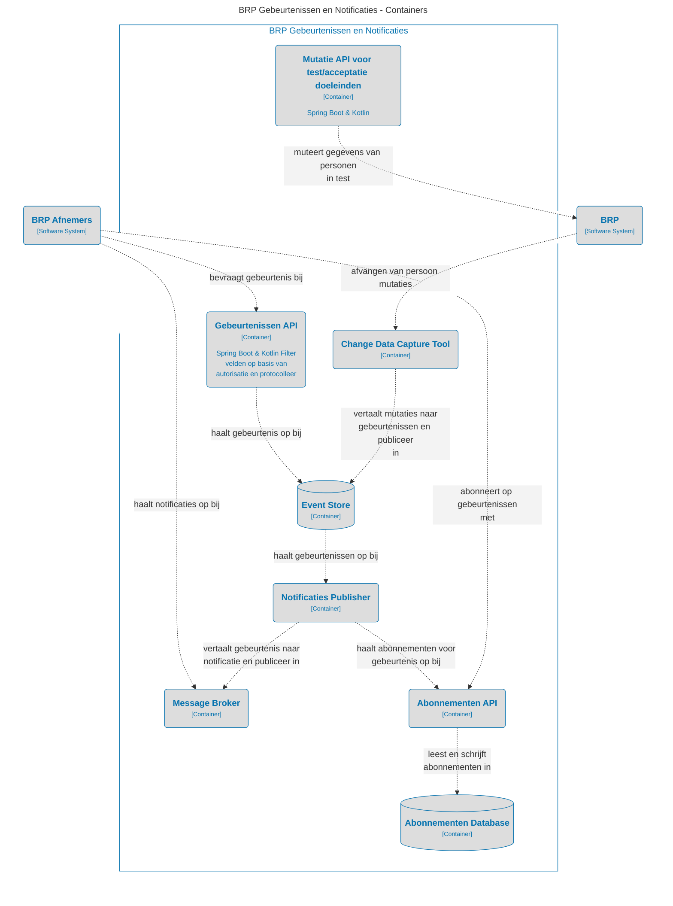

```mermaid
graph LR
  linkStyle default fill:#ffffff

  subgraph diagram ["BRP Gebeurtenissen en Notificaties - Containers"]
    style diagram fill:#ffffff,stroke:#ffffff

    1("<div style='font-weight: bold'>BRP</div><div style='font-size: 70%; margin-top: 0px'>[Software System]</div>")
    style 1 fill:#dddddd,stroke:#0773af,color:#0773af
    11("<div style='font-weight: bold'>BRP Afnemers</div><div style='font-size: 70%; margin-top: 0px'>[Software System]</div>")
    style 11 fill:#dddddd,stroke:#0773af,color:#0773af

    subgraph 2 ["BRP Gebeurtenissen en Notificaties"]
      style 2 fill:#ffffff,stroke:#0773af,color:#0773af

      10[("<div style='font-weight: bold'>Abonnementen Database</div><div style='font-size: 70%; margin-top: 0px'>[Container]</div>")]
      style 10 fill:#dddddd,stroke:#0773af,color:#0773af
      3("<div style='font-weight: bold'>Change Data Capture Tool</div><div style='font-size: 70%; margin-top: 0px'>[Container]</div>")
      style 3 fill:#dddddd,stroke:#0773af,color:#0773af
      4[("<div style='font-weight: bold'>Event Store</div><div style='font-size: 70%; margin-top: 0px'>[Container]</div>")]
      style 4 fill:#dddddd,stroke:#0773af,color:#0773af
      5("<div style='font-weight: bold'>Notificaties Publisher</div><div style='font-size: 70%; margin-top: 0px'>[Container]</div>")
      style 5 fill:#dddddd,stroke:#0773af,color:#0773af
      6("<div style='font-weight: bold'>Message Broker</div><div style='font-size: 70%; margin-top: 0px'>[Container]</div>")
      style 6 fill:#dddddd,stroke:#0773af,color:#0773af
      7("<div style='font-weight: bold'>Mutatie API voor test/acceptatie doeleinden</div><div style='font-size: 70%; margin-top: 0px'>[Container]</div><div style='font-size: 80%; margin-top:10px'>Spring Boot & Kotlin</div>")
      style 7 fill:#dddddd,stroke:#0773af,color:#0773af
      8("<div style='font-weight: bold'>Gebeurtenissen API</div><div style='font-size: 70%; margin-top: 0px'>[Container]</div><div style='font-size: 80%; margin-top:10px'>Spring Boot & Kotlin Filter<br />velden op basis van<br />autorisatie en protocolleer</div>")
      style 8 fill:#dddddd,stroke:#0773af,color:#0773af
      9("<div style='font-weight: bold'>Abonnementen API</div><div style='font-size: 70%; margin-top: 0px'>[Container]</div>")
      style 9 fill:#dddddd,stroke:#0773af,color:#0773af
    end

    11-. "<div>abonneert op gebeurtenissen<br />met</div><div style='font-size: 70%'></div>" .->9
    9-. "<div>leest en schrijft<br />abonnementen in</div><div style='font-size: 70%'></div>" .->10
    7-. "<div>muteert gegevens van personen<br />in test</div><div style='font-size: 70%'></div>" .->1
    1-. "<div>afvangen van persoon mutaties</div><div style='font-size: 70%'></div>" .->3
    3-. "<div>vertaalt mutaties naar<br />gebeurtenissen en publiceer<br />in</div><div style='font-size: 70%'></div>" .->4
    4-. "<div>haalt gebeurtenissen op bij</div><div style='font-size: 70%'></div>" .->5
    5-. "<div>haalt abonnementen voor<br />gebeurtenis op bij</div><div style='font-size: 70%'></div>" .->9
    5-. "<div>vertaalt gebeurtenis naar<br />notificatie en publiceer in</div><div style='font-size: 70%'></div>" .->6
    11-. "<div>haalt notificaties op bij</div><div style='font-size: 70%'></div>" .->6
    11-. "<div>bevraagt gebeurtenis bij</div><div style='font-size: 70%'></div>" .->8
    8-. "<div>haalt gebeurtenis op bij</div><div style='font-size: 70%'></div>" .->4
  end
```
