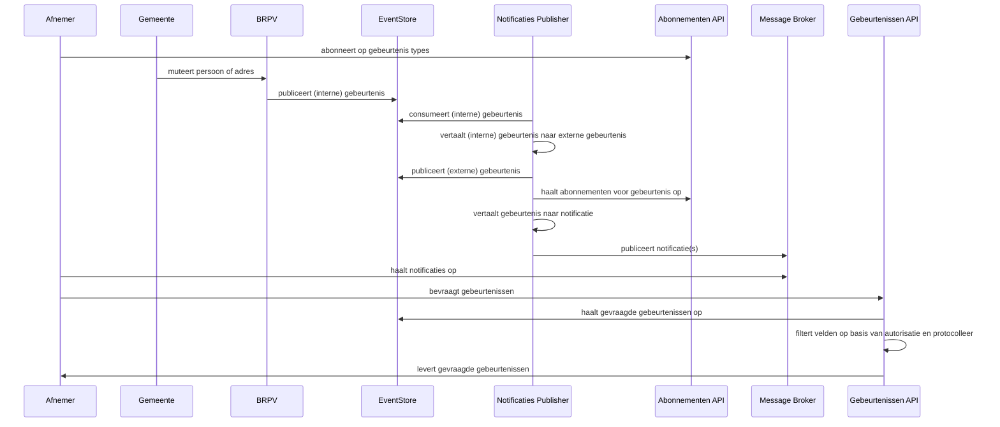

```mermaid
sequenceDiagram
    participant Afnemer
    participant Gemeente
    participant BRPV
    participant ES as EventStore
    participant NP as Notificaties Publisher
    participant SubApi as Abonnementen API
    participant MB as Message Broker
    participant EvtApi as Gebeurtenissen API

    Afnemer->>SubApi: abonneert op gebeurtenis types
    Gemeente->>BRPV: muteert persoon of adres
    BRPV->>ES: publiceert (interne) gebeurtenis
    NP->>ES: consumeert (interne) gebeurtenis
    NP->>NP: vertaalt (interne) gebeurtenis naar externe gebeurtenis
    NP->>ES: publiceert (externe) gebeurtenis
    NP->>SubApi: haalt abonnementen voor gebeurtenis op
    NP->>NP: vertaalt gebeurtenis naar notificatie
    NP->>MB: publiceert notificatie(s)
    Afnemer->>MB: haalt notificaties op
    Afnemer->>EvtApi: bevraagt gebeurtenissen
    EvtApi->>ES: haalt gevraagde gebeurtenissen op
    EvtApi->>EvtApi: filtert velden op basis van autorisatie en protocolleer
    EvtApi->>Afnemer: levert gevraagde gebeurtenissen
```