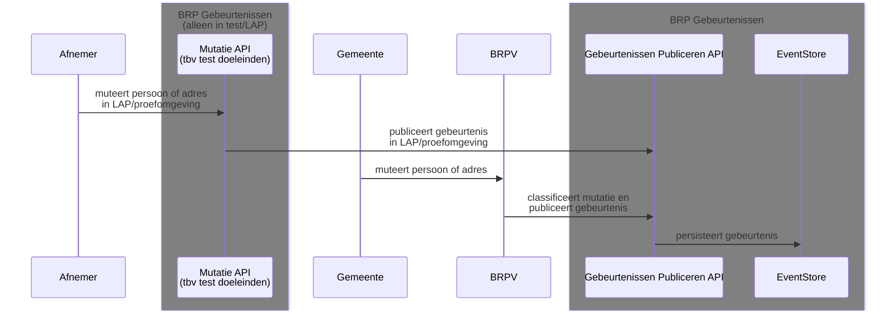
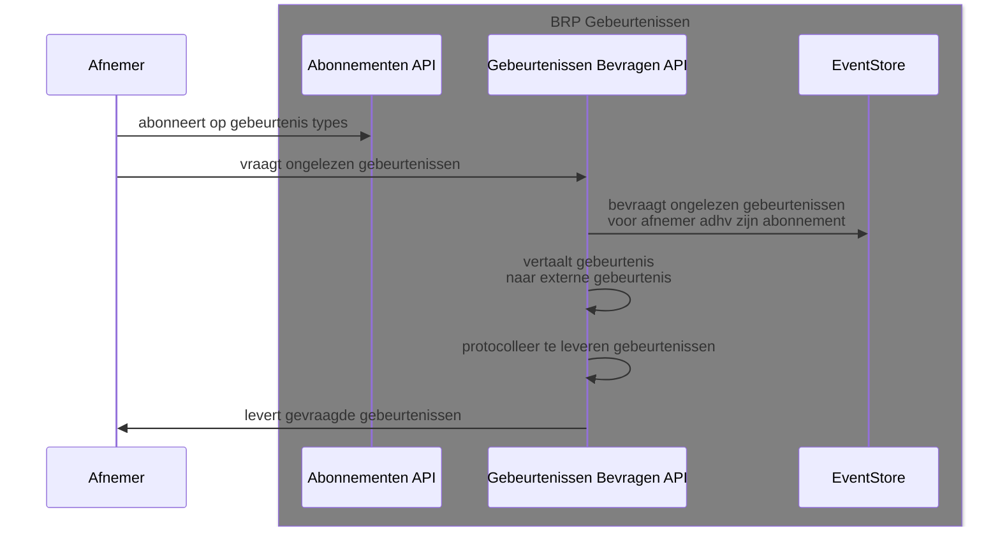

## Sequence diagram: publiceren van gebeurtenissen bij mutaties

```mermaid
sequenceDiagram
    participant Afnemer
    box Grey BRP Gebeurtenissen<br/>(alleen in test/LAP)
        participant MA as Mutatie API<br/>(tbv test doeleinden)
    end
    participant Gemeente
    participant BRPV
    box Grey BRP Gebeurtenissen
        participant EvtApi as Gebeurtenissen Publiceren API
        participant ES as EventStore
    end

    Afnemer->>MA: muteert persoon of adres<br/>in LAP/proefomgeving
    MA->>EvtApi: publiceert gebeurtenis<br/>in LAP/proefomgeving

    Gemeente->>BRPV: muteert persoon of adres
    BRPV->>EvtApi: classificeert mutatie en<br/>publiceert gebeurtenis

    EvtApi->>ES: persisteert gebeurtenis
```

## Sequence diagram: ongelezen gebeurtenissen bevragen door afnemer

```mermaid
sequenceDiagram
    participant Afnemer
    box Grey BRP Gebeurtenissen
        participant SubApi as Abonnementen API
        participant EvtApi as Gebeurtenissen Bevragen API
        participant ES as EventStore
    end

    Afnemer->>SubApi: abonneert op gebeurtenis types

    Afnemer->>EvtApi: vraagt ongelezen gebeurtenissen
    EvtApi->>ES: bevraagt ongelezen gebeurtenissen<br/> voor afnemer adhv zijn abonnement
    EvtApi->>EvtApi: vertaalt gebeurtenis<br/> naar externe gebeurtenis
    EvtApi->>EvtApi: protocolleer te leveren gebeurtenissen
    EvtApi->>Afnemer: levert gevraagde gebeurtenissen
```
