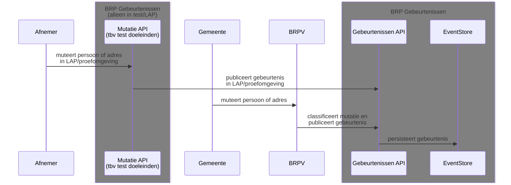
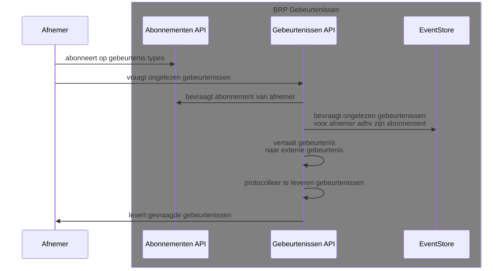
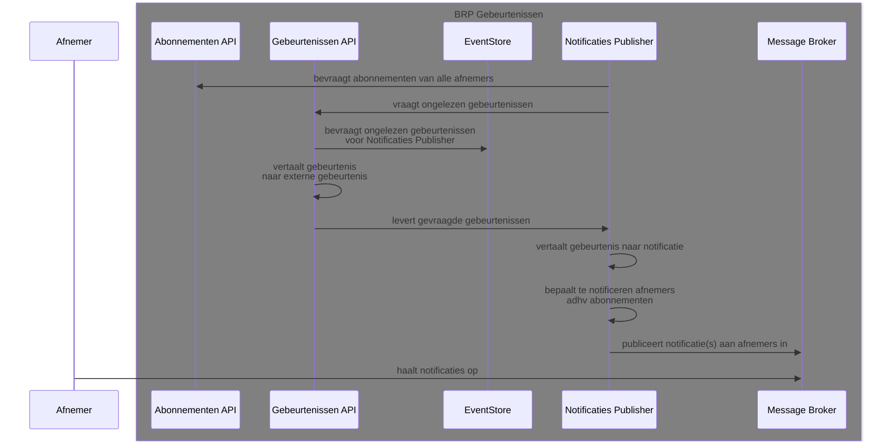

## Sequence diagram: publiceren van gebeurtenissen bij mutaties

## Sequence diagram: ongelezen gebeurtenissen bevragen door afnemer

## Sequence diagram: publiceren van notificaties door Notificaties Publisher
