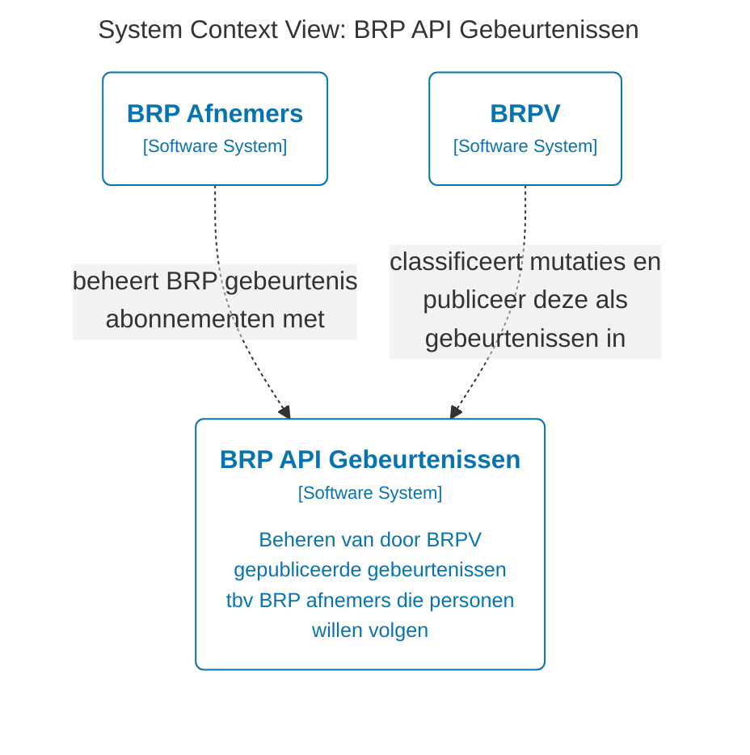

```mermaid
graph LR
  linkStyle default fill:#ffffff

  subgraph diagram ["System Context View: BRP API Gebeurtenissen"]
    style diagram fill:#ffffff,stroke:#ffffff

    1("<div style='font-weight: bold'>BRPV</div><div style='font-size: 70%; margin-top: 0px'>[Software System]</div>")
    style 1 fill:#ffffff,stroke:#0773af,color:#0773af
    14("<div style='font-weight: bold'>BRP Afnemers</div><div style='font-size: 70%; margin-top: 0px'>[Software System]</div>")
    style 14 fill:#ffffff,stroke:#0773af,color:#0773af
    2("<div style='font-weight: bold'>BRP API Gebeurtenissen</div><div style='font-size: 70%; margin-top: 0px'>[Software System]</div><div style='font-size: 80%; margin-top:10px'>Beheren van door BRPV<br />gepubliceerde gebeurtenissen<br />tbv BRP afnemers die personen<br />willen volgen</div>")
    style 2 fill:#ffffff,stroke:#0773af,color:#0773af

    14-. "<div>beheert BRP gebeurtenis<br />abonnementen met</div><div style='font-size: 70%'></div>" .->2
    1-. "<div>classificeert mutaties en<br />publiceer deze als<br />gebeurtenissen in</div><div style='font-size: 70%'></div>" .->2

  end
```
