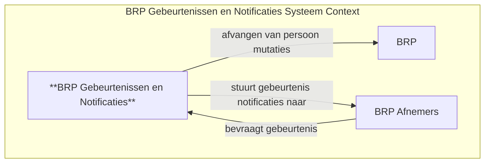

```mermaid
    flowchart LR

    subgraph "BRP Gebeurtenissen en Notificaties Systeem Context"
        direction LR

        BRPGN[**BRP Gebeurtenissen en Notificaties**]
        BRPAfn[BRP Afnemers]

        BRPGN -- afvangen van persoon mutaties --> BRP
        BRPGN -- stuurt gebeurtenis notificaties naar --> BRPAfn
        BRPAfn -- bevraagt gebeurtenis --> BRPGN

    end
```
