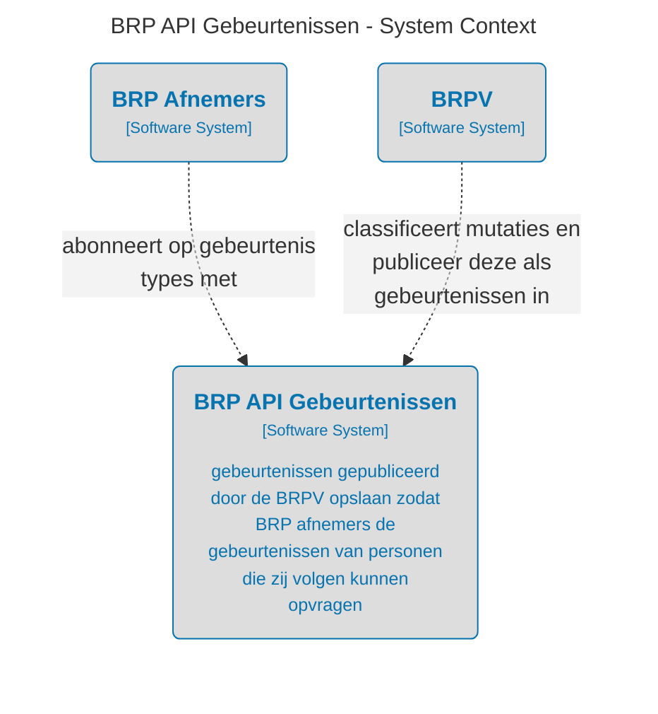

```mermaid
graph LR
  linkStyle default fill:#ffffff

  subgraph diagram ["BRP API Gebeurtenissen - System Context"]
    style diagram fill:#ffffff,stroke:#ffffff

    1("<div style='font-weight: bold'>BRPV</div><div style='font-size: 70%; margin-top: 0px'>[Software System]</div>")
    style 1 fill:#dddddd,stroke:#0773af,color:#0773af
    10("<div style='font-weight: bold'>BRP Afnemers</div><div style='font-size: 70%; margin-top: 0px'>[Software System]</div>")
    style 10 fill:#dddddd,stroke:#0773af,color:#0773af
    2("<div style='font-weight: bold'>BRP API Gebeurtenissen</div><div style='font-size: 70%; margin-top: 0px'>[Software System]</div><div style='font-size: 80%; margin-top:10px'>gebeurtenissen gepubliceerd<br />door de BRPV opslaan zodat<br />BRP afnemers de<br />gebeurtenissen van personen<br />die zij volgen kunnen<br />opvragen</div>")
    style 2 fill:#dddddd,stroke:#0773af,color:#0773af

    10-. "<div>abonneert op gebeurtenis<br />types met</div><div style='font-size: 70%'></div>" .->2
    1-. "<div>classificeert mutaties en<br />publiceer deze als<br />gebeurtenissen in</div><div style='font-size: 70%'></div>" .->2
  end
```
