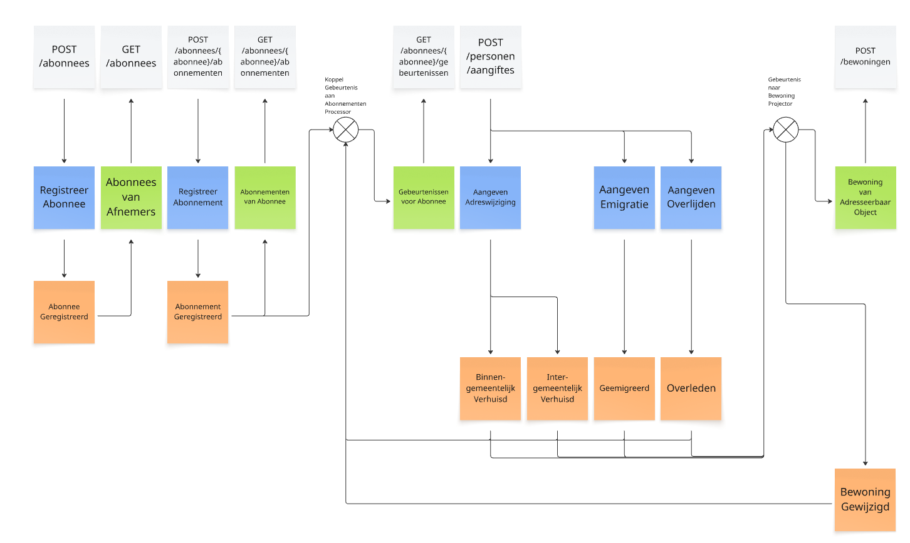

ADR0004: Event-Driven Architecture voor de BRP API

# Status
Voorstel

## Context
Afnemers van de BRP API willen op de hoogte worden gesteld van specifieke gebeurtenissen van personen aan wie zij diensten verlenen. Deze gebeurtenissen zijn bijvoorbeeld intergemeentelijk verhuisd, geëmigreerd en overleden. Systemen van afnemers hoeven dan niet meer regelmatig BRP API Personen te bevragen om te bepalen of de specifieke gebeurtenissen hebben plaatsgevonden.

De sub-systemen van de BRP API zijn ook geïnteresseerd in gebeurtenissen van personen die geregistreerd staan in de BRP. BRP API Bewoningen is bijvoorbeeld een BRP API sub-systeem dat kan worden geoptimaliseerd door gebruik te maken van gebeurtenissen van personen in de BRP. Op dit moment wordt bij elke bewoning bevraging met een complexe query en complexe logica bepaald welke personen (mogelijke) bewoners zijn van een adresseerbaar object in de gevraagde periode. De complexe query en logica zorgen ervoor dat er veel meer data uit de database moet worden opgehaald en zorgen ervoor dat het vaak veel langer duurt om de response voor een request te genereren.
Wanneer BRP API Bewoningen kan worden gedreven door gebeurtenissen, dan hoeft de complexe logica alleen te worden uitgevoerd wanneer specifieke gebeurtenissen hebben plaatsgevonden. Hierdoor hoeft er geen data uit de database te worden opgehaald omdat de relevante data al in de gebeurtenis zit. De bewoning bepaling kan vervolgens geoptimaliseerd worden gepersisteerd in bijvoorbeeld een database zodat met een simpele query de bewoners en de mogelijke bewoners van een adresseerbaar object in een periode kunnen worden opgehaald.

## Beslissingen
De Event-Driven Architecture (EDA) is de architectuur stijl die het beste past bij de behoeften van BRP API Gebeurtenissen. Binnen EDA staan gebeurtenissen centraal. Sub-systemen binnen een EDA communiceren met elkaar door middel van het publiceren en consumeren van gebeurtenissen. De sub-systemen zijn loosely coupled, wat betekent dat ze onafhankelijk van elkaar kunnen worden ontwikkeld, gedeployed en geschaald.

In onderstaand [event model](https://eventmodeling.org) is visueel weergeven hoe bestaande (en nieuwe) sub-systemen van de BRP API met behulp van gebeurtenissen met elkaar kunnen communiceren.

Figuur 1: Event Model van de BRP API

Met behulp van een event model worden de berichten binnen een systeem en hun relatie in kaart gebracht. Ook wordt met behulp van een event model de flow van de berichten weergegeven. In figuur 1 zijn de volgende event model elementen gebruikt:
- **Command (Blauw)**: Een bericht waarmee een verandering in de state van een systeem wordt geïnitieerd. Bijvoorbeeld: "Aangeven Adres Wijziging" of "Registreer Abonnement".
- **Event (Oranje)**: Een bericht waarmee de gegevens van een voor de business relevante gebeurtenis wordt beschreven. Deze gebeurtenis heeft plaatsgevonden als gevolg van een Command. Bijvoorbeeld: "Intergemeentelijk Verhuisd" of "Abonnement Geregistreerd".
- **View (Groen)**: Data die is ontstaan door het interpreteren en transformeren van gebeurtenissen voor een specifiek doel. Bijvoorbeeld: "Binnengemeentelijk Verhuisd, "Intergemeentelijk Verhuisd", "Geëmigreerd" en "Overleden" gebeurtenissen wordt door BRP API Bewoningen gebruikt om te bepalen wie wanneer bewoner is van adresseerbaar objecten.
- **Trigger (Wit)**: Een bouw blok waarmee de 'trigger' van een Command of de ontvanger van een Event of View wordt aangeduid. Bijvoorbeeld: de API endpoints waarmee abonnees en abonnementen worden geregistreerd en de API endpoint waarmee de bewoning van een adresseerbaar object op een moment kan worden bevraagd.
Zie de [Event Modeling Cheat Sheet](https://eventmodeling.org/posts/event-modeling-cheatsheet/) voor meer informatie over de elementen van een event model.

## Consequenties

Het implementeren van de Event-Driven Architecture stijl brengt zowel voordelen als nadelen en uitdagingen met zich mee. Deze worden hieronder beschreven. Bij de nadelen en uitdagingen worden ook mogelijke oplossingen beschreven.

### Voordelen
- Loosely Coupled. Sub-systemen binnen een EDA zijn loosely coupled, wat betekent dat ze onafhankelijk van elkaar kunnen worden ontwikkeld, gedeployed en geschaald. Hierdoor kunnen nieuwe sub-systemen worden toegevoegd zonder impact te hebben op bestaande sub-systemen en kunnen bestaande sub-systemen worden aangepast zonder impact te hebben op andere sub-systemen.
- Asynchroon. In een EDA communiceren sub-systemen asynchroon met elkaar, wat betekent dat ze niet hoeven te wachten op een response van een ander sub-systeem voordat ze verder kunnen gaan met hun eigen processing.

### Nadelen en Uitdagingen
- Complexiteit. Het implementeren van een Event-Driven systeem is complexer dan een traditioneel systeem, waarin de verschillende sub-systemen met elkaar communiceren volgens het Request-Response patroon. Ook moet er infrastructuur worden opgezet voor het routeren van gebeurtenissen van en naar de verschillende sub-systemen. Dit kan worden opgelost door het gebruik van een Event Store en Message Broker product, zoals Axon Server, dat out-of-the-box functionaliteit biedt voor het routeren van gebeurtenissen. Zie hierover meer in [ADR 003: BRP API Gebeurtenissen gebruikt Axon Server als Event Store en Event Bus/Message Broker](./003-axon-server.md).
- Eventual Consistency. In een Event Driven Architecture is het mogelijk dat er een vertraging optreedt tussen het moment dat een gebeurtenis plaatsvindt en het moment dat de gebeurtenis is verwerkt door alle sub-systemen die geïnteresseerd zijn in de gebeurtenis. Hierdoor kan het voorkomen dat de gegevens in de verschillende sub-systemen tijdelijk niet consistent zijn. Bijvoorbeeld: een afnemer ontvangt een gebeurtenis dat een persoon is verhuisd, maar BRP API Bewoningen heeft deze gebeurtenis nog niet verwerkt. Wanneer de afnemer de bewoning opvraagt van het oude adres van de betreffende persoon, dan ziet hij dat de persoon nog steeds op het oude adres woont.
- Tracing en Debugging. In een Event-Driven systeem is het moeilijker om de oorzaak van een fout te traceren en te debuggen, omdat de verschillende sub-systemen loosely coupled zijn en communiceren via gebeurtenissen. Dit kan worden opgelost door het implementeren van een goede logging en monitoring strategie met behulp van bijvoorbeeld [OpenTelemetry](https://opentelemetry.io/).
- (Gedeeltelijke) Data Duplicatie. In een Event-Driven systeem is het mogelijk dat dezelfde data in meerdere sub-systemen wordt opgeslagen, omdat elk sub-systeem zijn eigen data model heeft dat is geoptimaliseerd voor zijn eigen behoeften. Dit kan worden opgelost door het implementeren van een goede data governance strategie. Data die door de verschillende sub-systemen moet worden geleverd, zoals de naam en geboortedatum van personen, kunnen bijvoorbeeld worden opgeslagen in een centrale database, zoals de BRP Database, en kunnen worden opgehaald door de verschillende sub-systemen wanneer dat nodig is. De data die in gebeurtenissen wordt opgeslagen, kan worden beperkt tot alleen de data die relevant is voor de gebeurtenis. Bijvoorbeeld: bij een "Intergemeentelijk Verhuisd" gebeurtenis wordt alleen het anummer van de persoon (referentie om bijv. de naam van een persoon op te kunnen halen), de id van de nieuwe adresseerbaar object (referentie om adres gegevens op te kunnen halen) en de datum van de verhuizing opgeslagen.
- Lekken van privacy gevoelige data. In een Event-Driven systeem is het mogelijk dat privacy gevoelige data wordt opgeslagen in gebeurtenissen, waardoor er een risico is dat deze data kan worden gelekt. Dit kan worden opgelost door het implementeren van een goede data governance strategie. Privacy gevoelige data kan bijvoorbeeld geëncrypt worden opgeslagen bij een gebeurtenis. En wanneer een persoon de RvIG verzoekt om zijn gegevens te verwijderen, dan kunnen alle gebeurtenissen die betrekking hebben op de persoon worden verwijderd door de encryptie sleutel van de betreffende persoon weg te gooien, zodat zijn data in opgeslagen gebeurtenissen niet meer leesbaar zijn.
- Event Driven Architecture is een architectuur stijl die nog niet wordt toegepast binnen de RvIG. Hierdoor is er nog weinig kennis en ervaring binnen de RvIG met deze architectuur stijl. Er zal dus tijd en moeite moeten worden geïnvesteerd in het opdoen van kennis en ervaring met Event-Driven Architecture. De manier om de ervaring en kennis op te doen is door de Event-Driven Architecture stijl gefaseerd te introduceren en te implementeren in plaats van big bang. De Anti-Corruption Layer ontwerp patroon kan worden toegepast om bestaande externe systemen te integreren met BRP API Gebeurtenissen. Zo is bijvoorbeeld de **gebeurtenissen publiceren** endpoint geïntroduceerd zodat de classificatie module gebeurtenissen kan publiceren in BRP API Gebeurtenissen zonder nu al rekening te moeten houden met technische en implementatie keuzes binnen BRP API Gebeurtenissen. Ook is er voor gekozen om Event-Sourcing nog niet te implementeren. Hierdoor kan het aantal te publiceren gebeurtenistypen worden beperkt tot de gebeurtenistypen waar de afnemers van BRP API Gebeurtenissen de meeste behoefte aan hebben. Hiermee wordt de investering voor zowel de RvIG als de afnemers van BRP API Gebeurtenissen beperkt, terwijl er toch al ervaring kan worden opgedaan met het implementeren van een Event-Driven Architecture.

## Gerelateerde ADRs
- [ADR 003: BRP API Gebeurtenissen gebruikt Axon Server als Event Store en Event Bus/Message Broker](./003-axon-server.md)
