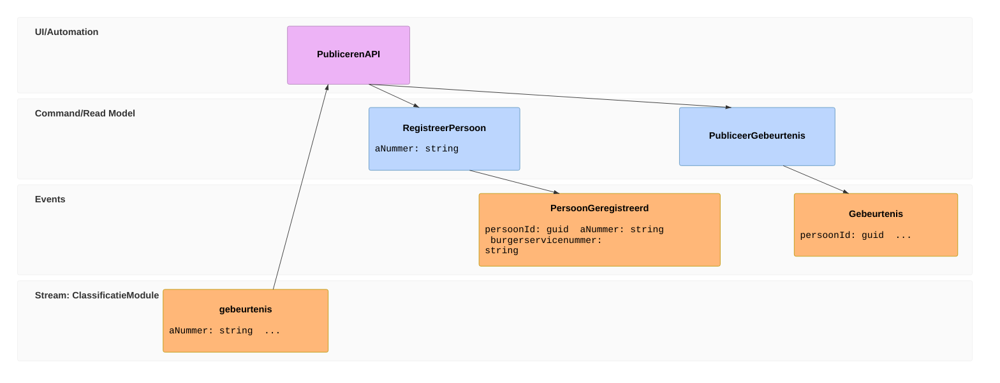
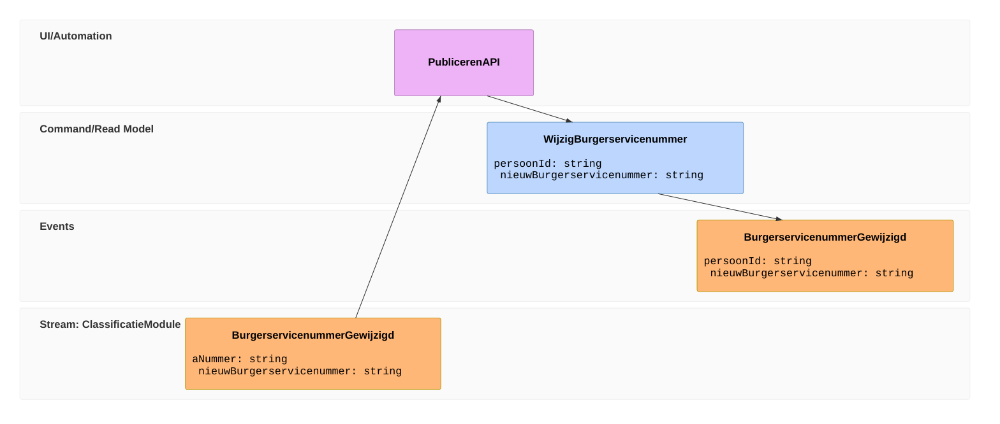
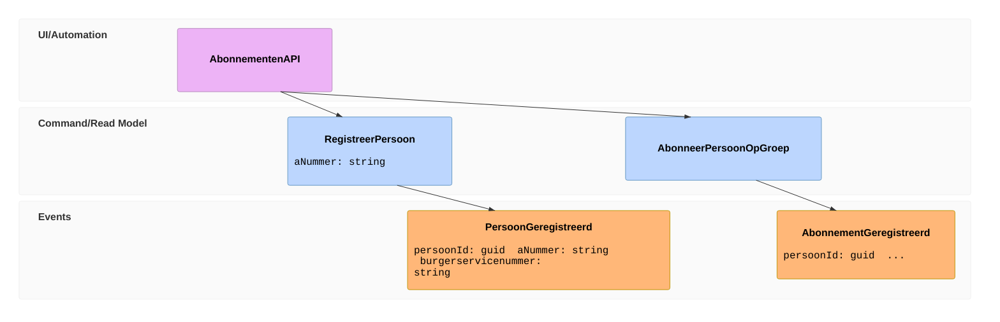

# ADR 006: Gebruik (interne) persoonsidentificatie voor personen in gebeurtenissen in BRP API Gebeurtenissen

## Context

Op dit moment worden gebeurtenissen van een persoon gepubliceerd met de a-nummer van de persoon om te kunnen bepalen om welke persoon het gaat. Echter afnemers abonneren zich op gebeurtenissen van personen met de burgerservicenummer van de persoon. Dit is ook het geval als een afnemer gebeurtenissen opvraagt.

De wens is om de Gebeurtenissen Publiceren API aan te passen (en hiermee ook de Classificatie Module) zodat gebeurtenissen van een persoon worden gepubliceerd met het burgerservicenummer van de persoon in plaats van het a-nummer. Hierdoor hoeft er geen translatie plaats te vinden van a-nummer naar burgerservicenummer bij het publiceren van en abonneren op gebeurtenissen, wat ten goede komt van de performance omdat deze translatie niet elke keer gedaan hoeft te worden wanneer de gebeurtenis wordt geraadpleegd. (Is dit nog het geval, worden de gebeurtenissen niet weggeschreven in de projectie met het burgerservicenummer?)

Hoewel zowel het a-nummer als het burgerservicenummer kunnen worden gebruikt om een persoon te identificeren, zijn zij niet betrouwbaar omdat het kan voorkomen dat het a-nummer en/of het burgerservicenummer moet worden gewijzigd. Hierdoor is het niet mogelijk om op basis van het a-nummer of burgerservicenummer te bepalen bij welke persoon een gebeurtenis hoort.

Ook kan de pl_id (de technische sleutel van de persoon in de BRP) niet worden gebruikt om een persoon uniek te identificeren, omdat deze ook kan wijzigen. Hierdoor kan er ook met de pl_id geen betrouwbare koppeling worden gemaakt tussen een gebeurtenis en een persoon.

## Voorstel

BRP API Gebeurtenissen genereert voor personen een unieke identificatie (GUID) en gebruikt deze om personen te koppelen aan gebeurtenissen.
Deze identificatie wordt gegenereerd op het moment dat de eerste gebeurtenis voor een persoon wordt gepubliceerd. Deze identificatie wordt samen met het a-nummer en burgerservicenummer van de persoon vastgelegd in een PersoonGeregistreerd gebeurtenis.
De te publiceren gebeurtenis wordt vervolgens vertaald naar een interne gebeurtenis waarin de persoon wordt geïdentificeerd met de gegenereerde GUID (persoonId) in plaats van met het a-nummer, burgerservicenummer, of pl_id.




```gherkin
Scenario: Een gebeurtenis wordt gepubliceerd voor een niet-geregistreerde persoon
    Gegeven een PersoonGeregistreerd gebeurtenis is niet voor 'Jan' gepubliceerd
    Als een aangifte van adreswijziging voor 'Jan' is verwerkt
    Dan is een PersoonGeregistreerd gebeurtenis voor 'Jan' gepubliceerd
    En is een 'verhuisd' gebeurtenis voor 'Jan' gepubliceerd

Scenario: Een gebeurtenis wordt gepubliceerd voor een geregistreerde persoon
    Gegeven een PersoonGeregistreerd gebeurtenis is voor 'Jan' gepubliceerd
    Als een aangifte van adreswijziging voor 'Jan' is verwerkt
    Dan is een 'verhuisd' gebeurtenis voor 'Jan' gepubliceerd
```

Deze interne identificatie (GUID) van een persoon blijft onveranderd, ongeacht of het a-nummer of het burgerservicenummer van de persoon wijzigt.




```gherkin
Abstract Scenario: Het <identificatienummer> van een geregistreerde persoon wijzigt
    Gegeven een PersoonGeregistreerd gebeurtenis is voor 'Jan' gepubliceerd
    Als het <identificatienummer> van 'Jan' wijzigt
    Dan is een <gebeurtenis> gebeurtenis voor 'Jan' gepubliceerd
    En is de persoonId in de gepubliceerde gebeurtenis gelijk aan de persoonId in de PersoonGeregistreerd gebeurtenis gepubliceerd voor 'Jan'

    Voorbeelden:
    | identificatienummer | gebeurtenis                  |
    | a-nummer            | ANummerGewijzigd             |
    | burgerservicenummer | BurgerservicenummerGewijzigd |
```

Het registreren van een persoon moet ook gebeuren als de persoon nog niet is geregistreerd wanneer een afnemer zich abonneert op gebeurtenissen voor die persoon. Het kan namelijk voorkomen dat een abonnee van afnemer zich wil abonneren op gebeurtenissen voor een persoon terwijl er voor deze persoon nog geen gebeurtenissen is gepubliceerd.



```gherkin
Scenario: Een abonnee abonneert zich op een groep gebeurtenissen voor een niet-geregistreerde persoon
    Gegeven een PersoonGeregistreerd gebeurtenis is niet voor 'Jan' gepubliceerd
    Als een abonnee zich abonneert op de persoon 'Jan' voor de groep 'client'
    Dan is een PersoonGeregistreerd gebeurtenis voor 'Jan' gepubliceerd
    En is een AbonnementGeregistreerd gebeurtenis voor de groep 'client' en persoon 'Jan' gepubliceerd

Scenario: Een abonnee abonneert zich op een groep gebeurtenissen voor een geregistreerde persoon
    Gegeven een PersoonGeregistreerd gebeurtenis is voor 'Jan' gepubliceerd
    Als een abonnee zich abonneert op de persoon 'Jan' voor de groep 'client'
    Dan is een AbonnementGeregistreerd gebeurtenis voor de groep 'client' en persoon 'Jan' gepubliceerd
```

Om de integriteit van de persoonId te waarborgen, moet bij elke te publiceren gebeurtenis worden gevalideerd of er meerdere personen voorkomen in de BRP database met het a-nummer of burgerservicenummer in de te publiceren gebeurtenis. Indien dit het geval is, mag de gebeurtenis niet worden gepubliceerd.

```gherkin
Scenario: Meerdere personen (persoonslijsten) in de BRP database hebben hetzelfde a-nummer dat is opgegeven in de te publiceren gebeurtenis
    Gegeven de persoon 'Jan' is geregistreerd in de BRP database met a-nummer '123456789'
    En de persoon 'Piet' is geregistreerd in de BRP database met hetzelfde a-nummer '123456789'
    Wanneer een gebeurtenis met a-nummer '123456789' wordt gepubliceerd
    Dan wordt de gebeurtenis niet gepubliceerd

Scenario: Meerdere personen (persoonslijsten) in de BRP database met verschillende a-nummers hebben dezelfde burgerservicenummer
    Gegeven de persoon 'Jan' is geregistreerd in de BRP database met a-nummer '123456789' en burgerservicenummer '987654321'
    En de persoon 'Piet' is geregistreerd in de BRP database met a-nummer '234567890' en hetzelfde burgerservicenummer '987654321'
    Wanneer een gebeurtenis met a-nummer '123456789' wordt gepubliceerd
    Dan wordt de gebeurtenis niet gepubliceerd

Scenario: Voor een geregistreerde persoon is in de BRP database een persoon (persoonslijst) toegevoegd met hetzelfde a-nummer of burgerservicenummer
    Gegeven de persoon 'Jan' is geregistreerd in de BRP database met a-nummer '123456789'
    En een PersoonGeregistreerd gebeurtenis is voor 'Jan' gepubliceerd
    En de persoon 'Piet' is vervolgens geregistreerd in de BRP database met hetzelfde a-nummer '123456789'
    Wanneer een gebeurtenis met a-nummer '123456789' wordt gepubliceerd
    Dan wordt de gebeurtenis niet gepubliceerd
```

Deze oplossing heeft een aantal voordelen:
1. Het minimaliseert de hoeveelheid gevoelige informatie die in interne gebeurtenissen wordt opgeslagen.
2. Gevoelige informatie wordt alleen opgenomen in de gebeurtenissen waar het relevant is. Het a-nummer van een persoon is bijvoorbeeld niet relevant voor een Verhuisd gebeurtenis.
3. De koppeling met de implementatie van de ClassificatieModule wordt geminimaliseerd, zodat de ClassificatieModule en BRP API Gebeurtenissen onafhankelijk van elkaar kunnen evolueren.
4. Het correleren van gebeurtenissen voor een persoon is eenvoudiger omdat dit kan gebeuren op basis van een sleutel die niet wijzigt.
5. De mapping tussen de interne persoonId en de externe identificatienummers (a-nummer, burgerservicenummer) staan vastgelegd in de PersoonGeregistreerd, AnummerGewijzigd en BurgerservicenummerGewijzigd gebeurtenissen. Deze kunnen tijdens het vertalen van externe naar interne gebeurtenissen worden ge-queried om de persoonId te achterhalen.