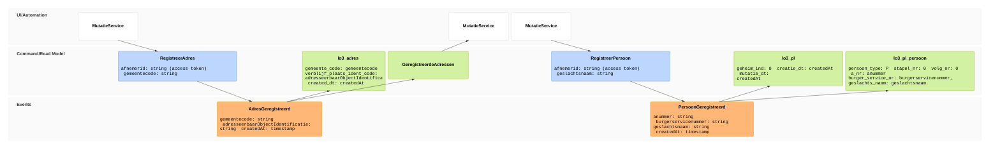

BRP API Gebeurtenissen Mutatie Service Event Model

```mermaid
eventmodeling

tf 01 ui MutatieService
tf 02 cmd RegistreerAdres [[RegistreerAdres]]
tf 03 evt AdresGeregistreerd [[AdresGeregistreerd]]
tf 04 rmo lo3_adres ->> 03 [[lo3_adres]]

tf 05 rmo GeregistreerdeAdressen
tf 06 ui MutatieService

rf 07 ui MutatieService
tf 08 cmd RegistreerPersoon [[RegistreerPersoon]]
tf 09 evt PersoonGeregistreerd [[PersoonGeregistreerd]]
tf 10 rmo lo3_pl ->> 09 [[lo3_pl]]
tf 11 rmo lo3_pl_persoon ->> 09 [[lo3_pl_persoon]]

data RegistreerAdres {
    afnemerid: string (access token)
    gemeentecode: string
}

data AdresGeregistreerd {
    gemeentecode: string
    adresseerbaarObjectIdentificatie: string
    createdAt: timestamp
}

data lo3_adres {
    gemeente_code: gemeentecode
    verblijf_plaats_ident_code: adresseerbaarObjectIdentificatie
    created_dt: createdAt
}

data RegistreerPersoon {
    afnemerid: string (access token)
    geslachtsnaam: string
}

data PersoonGeregistreerd {
    anummer: string
    burgerservicenummer: string
    geslachtsnaam: string
    createdAt: timestamp
}

data lo3_pl {
    geheim_ind: 0
    creatie_dt: createdAt
    mutatie_dt: createdAt
}

data lo3_pl_persoon {
    persoon_type: P
    stapel_nr: 0
    volg_nr: 0
    a_nr: anummer
    burger_service_nr: burgerservicenummer,
    geslachts_naam: geslachtsnaam
}
```
