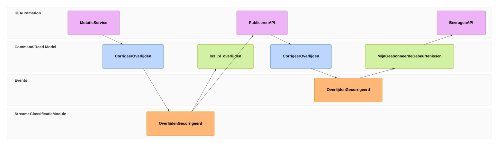

# Overlijden Gecorrigeerd Event Model

```mermaid
eventmodeling
tf 01 pcr MutatieService
tf 02 cmd CorrigeerOverlijden
tf 03 evt ClassificatieModule.OverlijdenGecorrigeerd
tf 04 rmo lo3_pl_overlijden
tf 05 pcr PublicerenAPI ->> 03
tf 06 cmd CorrigeerOverlijden
tf 07 evt OverlijdenGecorrigeerd
tf 08 rmo MijnGeabonneerdeGebeurtenissen
tf 09 pcr BevragenAPI
```
