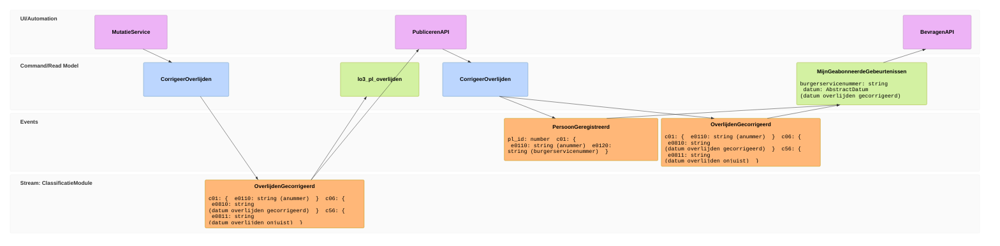

# Overlijden Gecorrigeerd Event Model

```mermaid

eventmodeling
tf 01 pcr MutatieService
tf 02 cmd CorrigeerOverlijden
tf 03 evt ClassificatieModule.OverlijdenGecorrigeerd [[OverlijdenGecorrigeerdIntern]]
tf 04 rmo lo3_pl_overlijden
tf 05 pcr PublicerenAPI ->> 03
tf 06 cmd CorrigeerOverlijden
tf 07 evt PersoonGeregistreerd [[PersoonGeregistreerdIntern]]
tf 08 evt OverlijdenGecorrigeerd [[OverlijdenGecorrigeerdIntern]]
tf 09 rmo MijnGeabonneerdeGebeurtenissen ->> 07 ->> 08[[OverlijdenGecorrigeerdExtern]]
tf 10 pcr BevragenAPI

data PersoonGeregistreerdIntern {
    pl_id: number
    c01: {
        e0110: string (anummer)
        e0120: string (burgerservicenummer)
    }
}
data OverlijdenGecorrigeerdIntern {
    c01: {
        e0110: string (anummer)
    }
    c06: {
        e0810: string (datum overlijden gecorrigeerd)
    }
    c56: {
        e0811: string (datum overlijden onjuist)
    }
}

data OverlijdenGecorrigeerdExtern {
    burgerservicenummer: string
    datum: AbstractDatum (datum overlijden gecorrigeerd)
}

```
