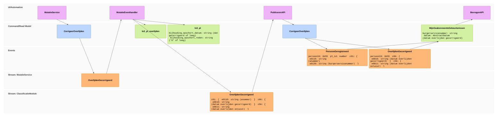

# Overlijden Gecorrigeerd Event Model

```mermaid

eventmodeling
tf 01 pcr MutatieService
tf 02 cmd CorrigeerOverlijden
tf 03 evt MutatieService.OverlijdenGecorrigeerd [[OverlijdenGecorrigeerdMutatie]]
tf 04 pcr MutatieEventhandler
tf 05 rmo lo3_pl_overlijden
tf 06 rmo lo3_pl [[plData]]
tf 07 evt ClassificatieModule.OverlijdenGecorrigeerd ->> 04 [[OverlijdenGecorrigeerdBRP]]
tf 08 pcr PublicerenAPI ->> 07
tf 09 cmd CorrigeerOverlijden
tf 10 evt PersoonGeregistreerd [[PersoonGeregistreerdIntern]]
tf 11 evt OverlijdenGecorrigeerd [[OverlijdenGecorrigeerdIntern]]
tf 12 rmo MijnGeabonneerdeGebeurtenissen ->> 10 ->> 11 [[OverlijdenGecorrigeerdExtern]]
tf 13 pcr BevragenAPI

data plData {
    bijhouding_opschort_datum: string (datum overlijden gecorrigeerd of leeg)
    bijhouding_opschort_reden: string ('O' of leeg)
}

data OverlijdenGecorrigeerdBRP {
    c01: {
        e0110: string (anummer)
    }
    c06: {
        e0810: string (datum overlijden gecorrigeerd)
    }
    c56: {
        e0811: string (datum overlijden onjuist)
    }
}

data PersoonGeregistreerdIntern {
    persoonId: GUID
    pl_id: number
    c01: {
        e0110: string (anummer)
        e0120: string (burgerservicenummer)
    }
}
data OverlijdenGecorrigeerdIntern {
    persoonId: GUID
    c06: {
        e0810: string (datum overlijden gecorrigeerd)
    }
    c56: {
        e0811: string (datum overlijden onjuist)
    }
}

data OverlijdenGecorrigeerdExtern {
    burgerservicenummer: string
    datum: AbstractDatum (datum overlijden gecorrigeerd)
}

```
