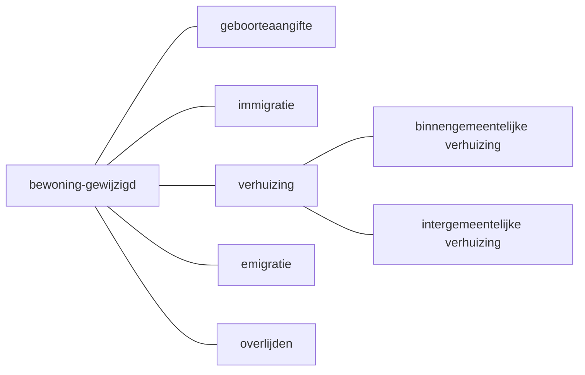

# Bewoning gewijzigd

Afvalstoffenheffing wil genotificeerd worden in situaties waarbij bewoning wijzigt in de gemeente Den Haag. Dit betreft alle inschrijvingen op adres, uitschrijvingen op adres en wijzigingen op adres.

Door onderscheid te maken tussen geboorte, immigratie, verhuizing, overlijden, emigratie of infrastructureel is duidelijk welke specifieke gebeurtenis heeft plaatsgevonden. Er wordt in [inschrijving op adres](./inschrijving-op-adres.feature) onderscheid gemaakt tussen immigratie, verhuizing en emigratie omdat dit in de praktijk ook andere processen zijn.

